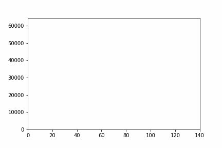
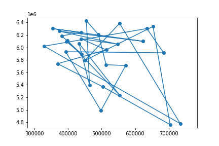
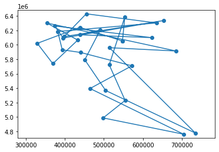
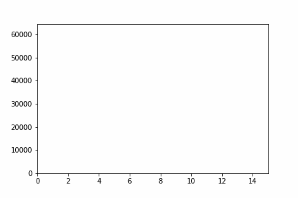
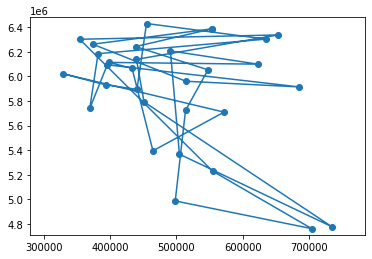
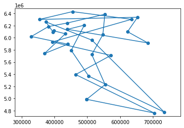

# Simulated Annealing: Travelling Salesman Problem

* Student: Trang Nguyen
* Group: BS18-DS01
* Source code: [https://github.com/tracy2811/tsp_sa](https://github.com/tracy2811/tsp_sa)

## Data

* Top 30 populated cities are selected from [https://github.com/hflabs/city/blob/master/city.csv](https://github.com/hflabs/city/blob/master/city.csv)
* Distance between cities (in km) are calculated using [geopy](https://geopy.readthedocs.io/en/stable/#module-geopy.distance)
* Latitude, longitude are converted to x y coordinates using [utm](https://pypi.org/project/utm/)

## Algorithm

1. Initialize path, time t = 0, temperature = initial distance, min temperature = temperature/10000
1. Generate new path by swapping two random cities in current path
1. Calculate acceptance ratio and update path
1. Repeat 2-3 N times (default N = 100)
1. Reduce temperature using [Exponential decay](https://en.wikipedia.org/wiki/Exponential_decay#Computer_science) (default decay constant = 0.05)
1. Increment time
1. Repeat 2-6 until cool down

## Result

The faster the cooling, the faster the convergence. However, for fast cooling, the output may not be optimal. Therefore, we should consider the cool temperature carefully, or increase iterations.

Decay constant | Speed of covergence | Final total distance (km)
--- | --- | ---
0.05 | 332.3 | 18373.3
0.5 | 2833.3 | 24883.1
0.005 | 3.4 | 17727.6

**Note**: speed of convergence = (last total distance - initial total distance) / time

### Decay constant = 0.05

#### Distance over time (decay constant = 0.05)

#### Path over time (decay constant = 0.05)

#### Final path (decay constant = 0.05)

### Decay constant = 0.5 (fast cooling)

#### Distance over time (decay constant = 0.5)

#### Path over time (decay constant = 0.5)

#### Final path (decay constant = 0.5)

### Decay constant = 0.005 (slow coooling)

#### Distance over time (decay constant = 0.005)

#### Final path (decay constant = 0.005)

